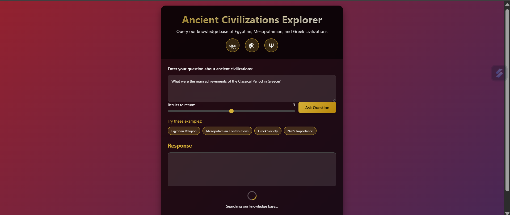
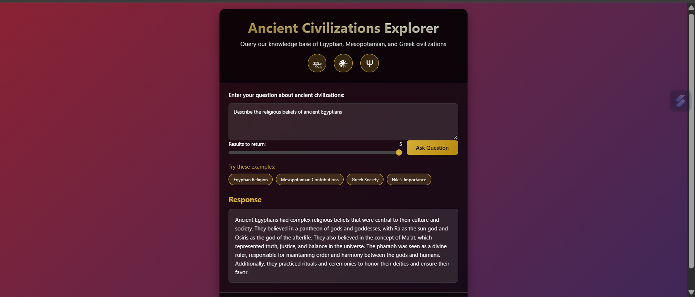
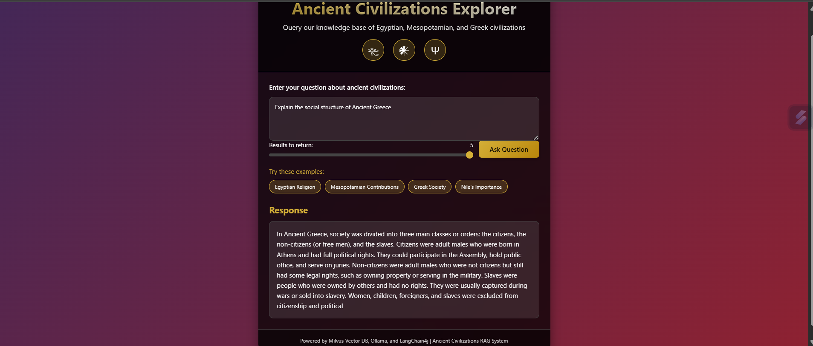

# 🏛️ Ancient Civilizations Explorer - RAG System

[](https://spring.io/projects/spring-boot)
[](https://milvus.io)
[](https://langchain4j.dev)
[](https://ollama.ai)
[](https://opensource.org/licenses/MIT)

RAG system for exploring ancient civilizations using Milvus, LangChain4j, and Spring Boot.

## ✨ Key Features
- UI with responsive design
- Semantic search powered by vector embeddings
- Adjustable results count (1-5)
- Example questions for quick testing
- Dynamic response typing animation
- Dockerized Milvus infrastructure

## 🧠 Tech Stack
- **Backend**: Spring Boot 2.7
- **Vector DB**: Milvus 2.4
- **AI Framework**: LangChain4j 0.33
- **LLM**: Ollama (phi model)
- **Frontend**: HTML/CSS/JS
- **Containerization**: Docker

## 🚀 Quick Start
```bash
# 1. Start Milvus infrastructure
cd infrastructure
docker-compose up -d

# 2. Run Spring Boot application
cd ../backend
mvn spring-boot:run

# 3. Access at http://localhost:8080
```

## 📸 Screenshots
| Main UI | Query Example | Response |
|---------|---------------|----------|
|  |  |  |

## ⚙️ Project Structure
```
 milvus-rag-app/
├── backend/
│   ├── src/
│   │   └── main/
│   │       ├── java/
│   │       │   └── com/
│   │       │       └── ragproject/
│   │       │           ├── config/
│   │       │           │   └── MilvusConfig.java
│   │       │           ├── controller/
│   │       │           │   ├── HomeController.java
│   │       │           │   └── RagController.java
│   │       │           ├── service/
│   │       │           │   ├── RagQueryService.java
│   │       │           │   └── RagService.java
│   │       │           └── RagApplication.java
│   │       └── resources/
│   │           ├── application.properties
│   │           ├── dataset/
│   │           │   └── ancient_civilizations.txt
│   │           └── static/
│   │               └── index.html
│   └── pom.xml
├── infrastructure/
│   └── docker-compose.yml
└── frontend-screenshots/
```

## ⚙️ Configuration
Edit `backend/src/main/resources/application.properties`:
```properties
milvus.host=127.0.0.1
milvus.port=19530
milvus.collectionName=ancient_civilizations
ollama.base-url=http://localhost:11434
ollama.model=phi
```

## 🌐 API Endpoint
```http
POST /api/rag/query
{
  "query": "Describe Egyptian religious beliefs",
  "maxResults": 3
}
```

## 🤝 Contributing
1. Fork the repository
2. Create feature branch (`git checkout -b feature/feature-name`)
3. Commit changes (`git commit -m 'Add feature'`)
4. Push to branch (`git push origin feature-name`)
5. Open Pull Request

## 📜 License
MIT License - See [LICENSE](LICENSE)

---
**Developed by [Habiba Basuony](https://github.com/habiba-basuony) - 2025**
```
